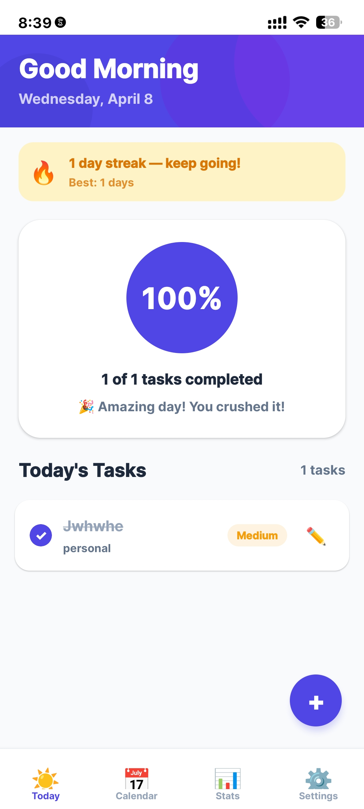
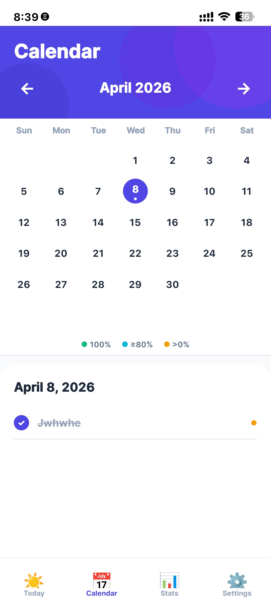
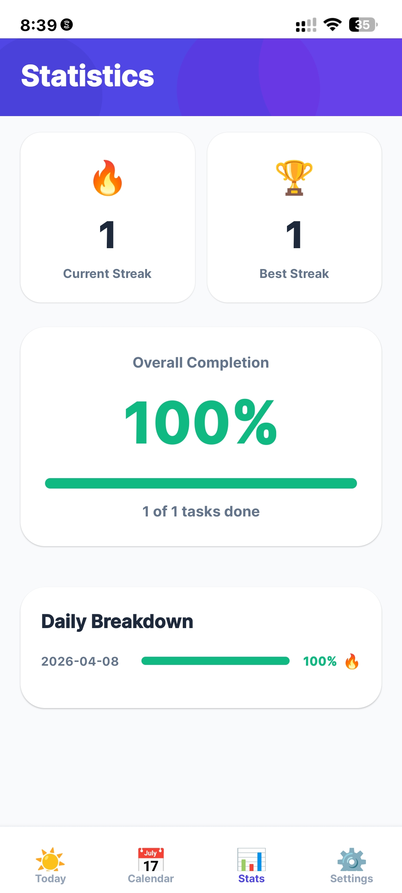
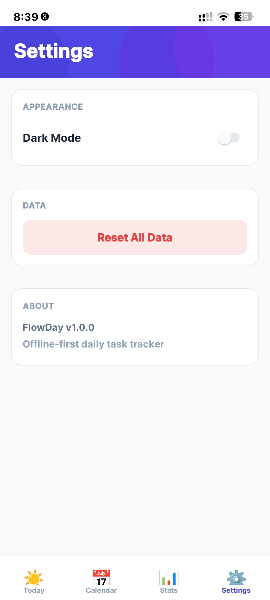

# FlowDay - Daily Task & Progress Tracker

**Plan today. Track progress.**

[](https://expo.dev)
[](https://reactnative.dev)
[](https://typescriptlang.org)
[](https://sqlite.org)

## 📱 About

FlowDay is an **offline-first mobile productivity app** that helps users:
- Plan daily tasks
- Track completion progress
- Build consistency streaks
- Stay motivated through visual feedback

**No internet required. Your data stays on your device.**

## ✨ Features

### Core Features
- ✅ **Today Dashboard** - Greeting, progress ring, streak card
- ✅ **Task Management** - Add, complete, edit, and delete tasks
- ✅ **Categories** - Personal, Work, School, Health, Errands
- ✅ **Priority Levels** - Low, Medium, High with color coding
- ✅ **Progress Tracking** - Visual progress ring with motivational messages
- ✅ **Calendar History** - Review past days with color-coded completion dots
- ✅ **Statistics Dashboard** - Current streak, best streak, completion rates, daily breakdown
- ✅ **Dark Mode** - Full dark theme persisted to device
- ✅ **Haptic Feedback** - Satisfying feedback on task completion
- ✅ **Onboarding** - Beautiful first-launch experience
- ✅ **Offline First** - All data stored locally with SQLite

### Coming Soon
- 🔜 Recurring tasks
- 🔜 Push reminders
- 🔜 Data export/backup
- 🔜 Cloud sync

## 📸 Screenshots

| Today | Calendar | Statistics | Settings |
|-------|----------|------------|----------|
|  |  |  |  |

## 🚀 Tech Stack

| Technology | Purpose |
|------------|---------|
| React Native + Expo 54 | Mobile framework |
| Expo Router | File-based navigation |
| SQLite | Local offline database |
| Zustand | State management |
| TypeScript | Type safety |
| date-fns | Date utilities |
| expo-haptics | Haptic feedback |

## 🏗️ Project Structure

```
flowday/
├── app/                    # Screens and navigation (Expo Router)
│   ├── (tabs)/            # Bottom navigation screens
│   │   ├── index.tsx      # Today Dashboard
│   │   ├── calendar.tsx   # Calendar History
│   │   ├── stats.tsx      # Statistics
│   │   └── settings.tsx   # Settings
│   ├── task/
│   │   ├── create.tsx     # Add Task
│   │   └── edit.tsx       # Edit Task
│   ├── onboarding.tsx     # First launch onboarding
│   └── _layout.tsx        # Root layout + DB init
├── components/            # Reusable UI components
│   └── GradientHeader.tsx # Mesh gradient header
├── db/                    # Database layer
│   ├── schema.ts          # SQLite table definitions
│   └── queries/
│       ├── tasks.ts       # Task CRUD operations
│       └── stats.ts       # Stats and streak queries
├── store/                 # Zustand state stores
│   ├── useTaskStore.ts    # Task state
│   ├── useStatsStore.ts   # Stats and streak state
│   └── useUIStore.ts      # Dark mode state
├── constants/
│   └── colors.ts          # Light/Dark theme tokens
├── utils/
│   └── useTheme.ts        # Theme hook
└── assets/                # Images and icons
```

## 🛠️ Installation

### Prerequisites
- Node.js (v18 or later)
- npm
- EAS CLI (`npm install -g eas-cli`)

### Setup

```bash
# Clone the repository
git clone https://github.com/albertii-alt/flowday.git
cd flowday

# Install dependencies
npm install --legacy-peer-deps

# Start development server
npx expo start --dev-client --tunnel
```

## 📱 Usage

1. **Add a task** — Tap the + button, fill in details
2. **Complete tasks** — Tap the checkbox (with haptic feedback)
3. **Delete tasks** — Long press on any task
4. **Edit tasks** — Tap the ✏️ button
5. **View calendar** — Tap Calendar tab to see history
6. **Track stats** — Tap Stats tab to see streaks and progress
7. **Dark mode** — Toggle in Settings tab

## 🔥 Streak System

A day counts toward your streak if you complete **≥80%** of your tasks.

| Tasks | Completed | Rate | Streak? |
|-------|-----------|------|---------|
| 5 | 4 | 80% | ✅ Yes |
| 5 | 3 | 60% | ❌ No |
| 3 | 3 | 100% | ✅ Yes |

## 🤝 Contributing

Contributions are welcome! Please:
1. Fork the repository
2. Create a feature branch
3. Submit a pull request

## 📄 License

MIT License - feel free to use this project for learning or production!

## 📞 Contact

albertiidaro0@gmail.com

Project Link: [https://github.com/albertii-alt/flowday](https://github.com/albertii-alt/flowday)

**Made with ❤️ for better productivity**
